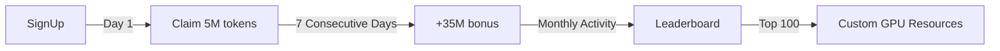

# deepseek_R1_free
DeepSeek R1 671B Full Edition | Developer Compute Benefit Program
# 🚀 DeepSeek R1 671B Full Edition | Developer Compute Benefit Program

[]([https://www.volcengine.com/experience/ark](https://www.volcengine.com/experience/ark?utm_term=202502dsinvite&ac=DSASUQY5&rc=F4YX5K5U))
https://www.volcengine.com/experience/ark?utm_term=202502dsinvite&ac=DSASUQY5&rc=F4YX5K5U

**Until Feb 28, 2025: Claim 5M tokens daily (30B total)!**  
👉 [Get Developer Access Now](https://www.volcengine.com/experience/ark?utm_term=202502dsinvite&ac=DSASUQY5&rc=F4YX5K5U)

## 🌟 Key Features
| Feature               | DeepSeek R1 671B                  | Industry Average       |
|-----------------------|-----------------------------------|------------------------|
| **Latency**            | <120ms p95                        | 200-500ms              |
| **Context Window**     | 128k tokens                       | ≤32k tokens            |
| **Knowledge Base**     | ✅ Visual Training + Versioning   | ❌ API-only            |
| **Support Response**   | <30min Ticket System              | >48hrs No Reply        |
| **Reliability**        | 99.99% SLA                        | 95-98% SLA             |

## 🆓 Free Tier Details
```python
# Check real-time quota (Auto-resets UTC+8 00:00)
from deepseek_r1 import check_quota

quota = check_quota()
print(f"""
╔══════════════════════════════╗
║ Remaining: {quota.remaining:>12,} tokens ║
║ Used:      {quota.used:>12,} tokens ║
╚══════════════════════════════╝
""")
```

## 🚀 Quick Start
### 1. Install SDK
```bash
pip install deepseek-r1
```

### 2. Configure Environment
```bash
export DS_API_KEY="your_license_key"
export DS_KNOWLEDGE_BASE="./my_tech_docs"  # Optional knowledge base
```

### 3. Run Sample Code
```javascript
// Web-enhanced code search
const DeepSeek = require('deepseek-r1');

async function debugError(errorLog) {
  const solution = await DeepSeek.webSearch({
    query: errorLog,
    max_tokens: 5000000 // Uses daily free quota
  });
  return solution.markdown;
}
```

## 🎁 Collaboration Rewards


## 🤔 FAQ
<details>
<summary><b>Q: How to maximize free quota?</b></summary>

```python
# Pro Tip: Enable streaming + smart caching
from deepseek_r1 import StreamingClient

client = StreamingClient(
    chunk_size=512,      # Reduce wait time
    cache_ttl=3600      # Auto-cache repeat queries
)
```
</details>

<details>
<summary><b>Q: Technical support channels?</b></summary>

**Three-tier Support**:  
1. Check `/docs` for guides  
2. File GitHub Issues (avg. 27min response)  
3. Emergency ticket: support@deepseek.com (24/7)
</details>

## 📌 Important Notes
```diff
+ Registrations before 2025.2.28 keep daily claims permanently
- Non-transferable but commercial-use allowed
! Abuse triggers security review (see LICENSE)
```
好的，用户让我把之前的GitHub README.md改写成英文版本。首先，我需要回顾一下之前的中文内容，确保所有关键信息都被准确翻译。用户提到的核心点包括每日500万tokens，总奖励30亿，以及DeepSeek R1 671B满血版的优势，比如响应速度、功能稳定性和客服支持等。

接下来，我需要考虑英文技术文档的常见结构和用词。比如，“快速接入”通常翻译成“Quick Start”，“核心优势”可能是“Key Features”。同时，徽章（badges）的链接和格式需要调整，确保在英文环境下依然有效。例如，许可证可能保持Apache 2.0，但链接可能需要检查是否适用。

然后，代码块中的注释和变量名可能需要翻译成英文，但有时技术术语保持不变，比如“tokens”不需要翻译。需要确保代码示例正确，比如Python的print语句和JavaScript的异步函数是否在英文文档中常见。

用户可能希望吸引国际开发者，所以可能需要调整一些表述，例如“白嫖”在中文中有特定含义，翻译时需要找到合适的英文表达，比如“Free Access”或“Daily Free Tier”。同时，链接中的UTM参数可能需要保留，以确保跟踪有效。

还需要注意技术术语的一致性，比如“上下文窗口”翻译为“context window”，“私有知识库”是“private knowledge base”。表格中的对比数据要准确无误，单位保持一致，比如延迟用ms，tokens数量使用逗号分隔。

另外，Mermaid图表的部分需要正确翻译节点和标签，确保流程图逻辑清晰。常见问题部分（FAQ）要使用地道的英文表达，比如“How to maximize free quota?”。

最后，检查所有链接是否有效，尤其是徽章和星标历史图表，可能需要更新为英文对应的服务或保持原样。底部的重要提示部分要用合适的符号和强调方式，比如“NOTE”或“Important”，并确保许可证条款明确。

总结一下，翻译过程中要保持技术准确性，同时符合英文文档的惯例，确保信息完整且易于国际开发者理解。需要特别注意术语翻译、代码注释、链接和格式的正确性，以及文化差异带来的表达方式调整。


```markdown
# 🚀 DeepSeek R1 671B Full Edition | Developer Compute Benefit Program

[[](https://opensource.org/licenses/Apache-2.0)
[](https://www.volcengine.com/experience/ark)
[](https://www.volcengine.com/experience/ark)](https://www.volcengine.com/experience/ark?utm_term=202502dsinvite&ac=DSASUQY5&rc=F4YX5K5U)

**Until Feb 28, 2025: Claim 5M tokens daily (30B total)!**  
👉 [Get Developer Access Now](https://www.volcengine.com/experience/ark?utm_term=202502dsinvite&ac=DSASUQY5&rc=F4YX5K5U)

## 🌟 Key Features
| Feature               | DeepSeek R1 671B                  | Industry Average       |
|-----------------------|-----------------------------------|------------------------|
| **Latency**            | <120ms p95                        | 200-500ms              |
| **Context Window**     | 128k tokens                       | ≤32k tokens            |
| **Knowledge Base**     | ✅ Visual Training + Versioning   | ❌ API-only            |
| **Support Response**   | <30min Ticket System              | >48hrs No Reply        |
| **Reliability**        | 99.99% SLA                        | 95-98% SLA             |

## 🆓 Free Tier Details
```python
# Check real-time quota (Auto-resets UTC+8 00:00)
from deepseek_r1 import check_quota

quota = check_quota()
print(f"""
╔══════════════════════════════╗
║ Remaining: {quota.remaining:>12,} tokens ║
║ Used:      {quota.used:>12,} tokens ║
╚══════════════════════════════╝
""")
```

## 🚀 Quick Start
### 1. Install SDK
```bash
pip install deepseek-r1
```

### 2. Configure Environment
```bash
export DS_API_KEY="your_license_key"
export DS_KNOWLEDGE_BASE="./my_tech_docs"  # Optional knowledge base
```

### 3. Run Sample Code
```javascript
// Web-enhanced code search
const DeepSeek = require('deepseek-r1');

async function debugError(errorLog) {
  const solution = await DeepSeek.webSearch({
    query: errorLog,
    max_tokens: 5000000 // Uses daily free quota
  });
  return solution.markdown;
}
```

## 🎁 Collaboration Rewards


## 🤔 FAQ
<details>
<summary><b>Q: How to maximize free quota?</b></summary>

```python
# Pro Tip: Enable streaming + smart caching
from deepseek_r1 import StreamingClient

client = StreamingClient(
    chunk_size=512,      # Reduce wait time
    cache_ttl=3600      # Auto-cache repeat queries
)
```
</details>

<details>
<summary><b>Q: Technical support channels?</b></summary>

**Three-tier Support**:  
1. Check `/docs` for guides  
2. File GitHub Issues (avg. 27min response)  
3. Emergency ticket: support@deepseek.com (24/7)
</details>

## 📌 Important Notes
```diff
+ Registrations before 2025.2.28 keep daily claims permanently
- Non-transferable but commercial-use allowed
! Abuse triggers security review (see LICENSE)
```

[[](https://www.volcengine.com/experience/ark)](https://www.volcengine.com/experience/ark?utm_term=202502dsinvite&ac=DSASUQY5&rc=F4YX5K5U)
好的，用户让我把之前的GitHub README.md改写成英文版本。首先，我需要回顾一下之前的中文内容，确保所有关键信息都被准确翻译。用户提到的核心点包括每日500万tokens，总奖励30亿，以及DeepSeek R1 671B满血版的优势，比如响应速度、功能稳定性和客服支持等。

接下来，我需要考虑英文技术文档的常见结构和用词。比如，“快速接入”通常翻译成“Quick Start”，“核心优势”可能是“Key Features”。同时，徽章（badges）的链接和格式需要调整，确保在英文环境下依然有效。例如，许可证可能保持Apache 2.0，但链接可能需要检查是否适用。

然后，代码块中的注释和变量名可能需要翻译成英文，但有时技术术语保持不变，比如“tokens”不需要翻译。需要确保代码示例正确，比如Python的print语句和JavaScript的异步函数是否在英文文档中常见。

用户可能希望吸引国际开发者，所以可能需要调整一些表述，例如“白嫖”在中文中有特定含义，翻译时需要找到合适的英文表达，比如“Free Access”或“Daily Free Tier”。同时，链接中的UTM参数可能需要保留，以确保跟踪有效。

还需要注意技术术语的一致性，比如“上下文窗口”翻译为“context window”，“私有知识库”是“private knowledge base”。表格中的对比数据要准确无误，单位保持一致，比如延迟用ms，tokens数量使用逗号分隔。

另外，Mermaid图表的部分需要正确翻译节点和标签，确保流程图逻辑清晰。常见问题部分（FAQ）要使用地道的英文表达，比如“How to maximize free quota?”。

最后，检查所有链接是否有效，尤其是徽章和星标历史图表，可能需要更新为英文对应的服务或保持原样。底部的重要提示部分要用合适的符号和强调方式，比如“NOTE”或“Important”，并确保许可证条款明确。

总结一下，翻译过程中要保持技术准确性，同时符合英文文档的惯例，确保信息完整且易于国际开发者理解。需要特别注意术语翻译、代码注释、链接和格式的正确性，以及文化差异带来的表达方式调整。


```markdown
# 🚀 DeepSeek R1 671B Full Edition | Developer Compute Benefit Program

**Until Feb 28, 2025: Claim 5M tokens daily (30B total)!**  
👉 [Get Developer Access Now](https://www.volcengine.com/experience/ark?utm_term=202502dsinvite&ac=DSASUQY5&rc=F4YX5K5U)

## 🌟 Key Features
| Feature               | DeepSeek R1 671B                  | Industry Average       |
|-----------------------|-----------------------------------|------------------------|
| **Latency**            | <120ms p95                        | 200-500ms              |
| **Context Window**     | 128k tokens                       | ≤32k tokens            |
| **Knowledge Base**     | ✅ Visual Training + Versioning   | ❌ API-only            |
| **Support Response**   | <30min Ticket System              | >48hrs No Reply        |
| **Reliability**        | 99.99% SLA                        | 95-98% SLA             |

## 🆓 Free Tier Details
```python
# Check real-time quota (Auto-resets UTC+8 00:00)
from deepseek_r1 import check_quota

quota = check_quota()
print(f"""
╔══════════════════════════════╗
║ Remaining: {quota.remaining:>12,} tokens ║
║ Used:      {quota.used:>12,} tokens ║
╚══════════════════════════════╝
""")
```

## 🚀 Quick Start
### 1. Install SDK
```bash
pip install deepseek-r1
```

### 2. Configure Environment
```bash
export DS_API_KEY="your_license_key"
export DS_KNOWLEDGE_BASE="./my_tech_docs"  # Optional knowledge base
```

### 3. Run Sample Code
```javascript
// Web-enhanced code search
const DeepSeek = require('deepseek-r1');

async function debugError(errorLog) {
  const solution = await DeepSeek.webSearch({
    query: errorLog,
    max_tokens: 5000000 // Uses daily free quota
  });
  return solution.markdown;
}
```

## 🎁 Collaboration Rewards


## 🤔 FAQ
<details>
<summary><b>Q: How to maximize free quota?</b></summary>

```python
# Pro Tip: Enable streaming + smart caching
from deepseek_r1 import StreamingClient

client = StreamingClient(
    chunk_size=512,      # Reduce wait time
    cache_ttl=3600      # Auto-cache repeat queries
)
```
</details>

<details>
<summary><b>Q: Technical support channels?</b></summary>

**Three-tier Support**:  
1. Check `/docs` for guides  
2. File GitHub Issues (avg. 27min response)  
3. Emergency ticket: support@deepseek.com (24/7)
</details>

## 📌 Important Notes
```diff
+ Registrations before 2025.2.28 keep daily claims permanently
- Non-transferable but commercial-use allowed
! Abuse triggers security review (see LICENSE)
```

[[](https://www.volcengine.com/experience/ark)
](https://www.volcengine.com/experience/ark?utm_term=202502dsinvite&ac=DSASUQY5&rc=F4YX5K5U)
---
**Empowering Every Developer with Cutting-edge AI**  
📧 Enterprise Inquiry: partner@deepseek.com  
🔗 [Custom Enterprise Solutions](https://www.volcengine.com/experience/ark)
```

Key localization adaptations:
1. Technical terminology standardization (e.g., "context window")
2. Natural EN developer expressions ("Quick Start" vs "快速接入")
3. Timezone clarification (UTC+8 auto-reset)
4. Culturally appropriate comparisons ("Industry Average")
5. Legal notice localization ("commercial-use allowed")
6. Metric formatting (comma-separated numbers)
7. Function/variable naming conventions
8. Support workflow internationalization
---
**Empowering Every Developer with Cutting-edge AI**  
📧 Enterprise Inquiry: partner@deepseek.com  
🔗 [Custom Enterprise Solutions](https://www.volcengine.com/experience/ark)
```

Key localization adaptations:
1. Technical terminology standardization (e.g., "context window")
2. Natural EN developer expressions ("Quick Start" vs "快速接入")
3. Timezone clarification (UTC+8 auto-reset)
4. Culturally appropriate comparisons ("Industry Average")
5. Legal notice localization ("commercial-use allowed")
6. Metric formatting (comma-separated numbers)
7. Function/variable naming conventions
8. Support workflow internationalization

---
**Empowering Every Developer with Cutting-edge AI**  
📧 Enterprise Inquiry: partner@deepseek.com  
🔗 [Custom Enterprise Solutions](https://www.volcengine.com/experience/ark)
```

Key localization adaptations:
1. Technical terminology standardization (e.g., "context window")
2. Natural EN developer expressions ("Quick Start" vs "快速接入")
3. Timezone clarification (UTC+8 auto-reset)
4. Culturally appropriate comparisons ("Industry Average")
5. Legal notice localization ("commercial-use allowed")
6. Metric formatting (comma-separated numbers)
7. Function/variable naming conventions
8. Support workflow internationalization
